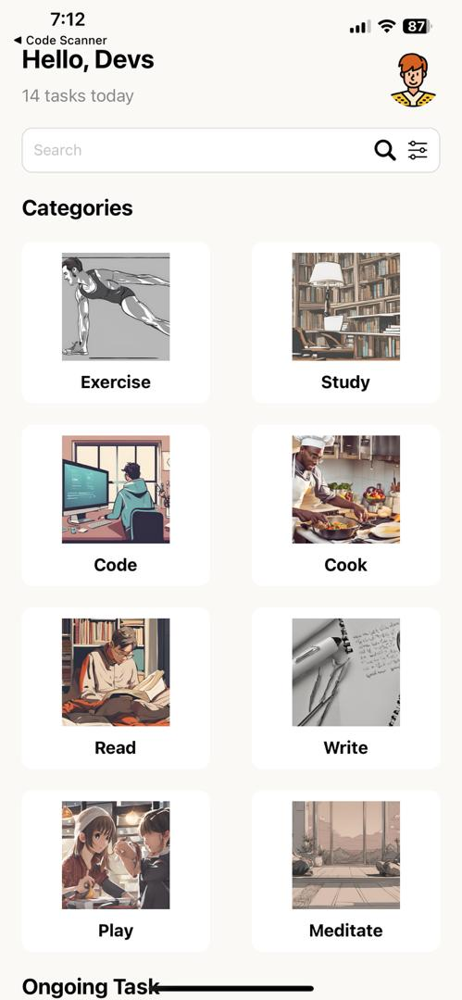
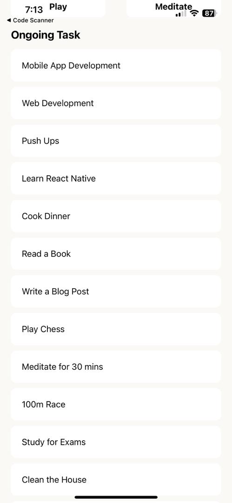

# -rn-assignment3-ID-11130070
# Task Management App

A simple task management app built with React Native, featuring categories and ongoing tasks. The app demonstrates how to create a structured UI with reusable components.

## Components

### `App.js`
The main entry point of the application. It combines various components to render the full UI, including the header, search bar, categories list, and ongoing tasks list.

- **Props:**
  - `title` (string): The title of the category.
  - `image` (image): The image associated with the category.

- **Props:**
  - `title` (string): The title of the task.

  ## Screenshots
  ## 
  ## 